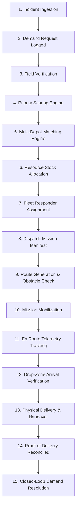

# SAKSHAM — Disaster Relief Resource-Demand Matching & Logistics Platform

> **National & Regional Emergency Resource Coordination System**  
> Unified Common Operating Picture (COP), Decision-Support Priority Engine, Google OR-Tools Multi-Depot Optimization, Live Fleet Routing, Proof-of-Delivery Reconciliation, and Immutable Audit Trail.

---

## 🏛️ System Architecture

```
SAKSHAM/
├── apps/
│   ├── web/                    # React 18 + TypeScript + Vite Emergency Operations Platform
│   │   ├── src/pages/CommandCenter/   # Unified COP Dashboard & 6 Core Operational Questions
│   │   ├── src/pages/Matching/        # 100-Point Demand Priority & Multi-Factor Matching Engine
│   │   ├── src/pages/Dispatch/        # Fleet Dispatch, Live Routing & Road Rerouting Alerts
│   │   ├── src/pages/Delivery/        # Receiver Verification, POD & Closed-Loop Resolution
│   │   ├── src/pages/Analytics/       # Data-Driven Analytics & Immutable 11-Step Audit Ledger
│   │   ├── src/components/map/        # 9-Layer MapLibre GIS Common Operating Picture
│   │   └── src/context/               # Operational State Context Store & Deterministic Seeds
│   └── mobile/                 # Mobile Responder Application
│
├── services/
│   └── api/                    # Node.js + Express + TypeScript + Prisma Core API
│       ├── src/modules/matching/      # Resource-Demand Compatibility & Quota Allocation Engine
│       ├── src/modules/decision/      # Transparent Severity, Urgency & Priority Scoring
│       └── src/tests/                 # 57 Automated Vitest Unit & End-to-End Workflow Tests
│
├── optimization/               # Python FastAPI + Google OR-Tools MIP Logistics Optimization
├── docs/                       # Architecture, Decision Engine, and Deployment Documentation
└── docker-compose.yml          # Multi-Service Production Deployment Specification
```

---

## 🚀 Quick Start (Local Development)

### 1. Web Frontend (`apps/web`)
```bash
cd apps/web
npm install
npm run dev
```
Open **`http://localhost:5173`** in your browser.

### 2. Core API Backend (`services/api`)
```bash
cd services/api
npm install
npm run dev
```
Open **`http://localhost:4000`** in your browser.

### 3. Run Backend Tests
```bash
cd services/api
npm test
```
*57 of 57 tests passing covering priority scoring, compatibility matching, quota allocation, and end-to-end multi-step workflow verification.*

---

## 🎯 15-Step Closed-Loop Operational Workflow



---

## 🛡️ Production Readiness & Deployment

Detailed deployment guide available at [`docs/PRODUCTION_DEPLOYMENT.md`](docs/PRODUCTION_DEPLOYMENT.md).

- **Zero External API Dependency:** Self-contained deterministic Indian disaster scenario (Delhi Yamuna River flood surge) ensures reproducible evaluations.
- **Configurable Endpoints:** Environment variables externalized via `.env.example` across all modules.
- **Zero Committed Secrets:** All credentials, keys, and connection strings managed via environment runtime.
- **Production Build Validated:** `npm run build` succeeds cleanly across frontend and backend.
