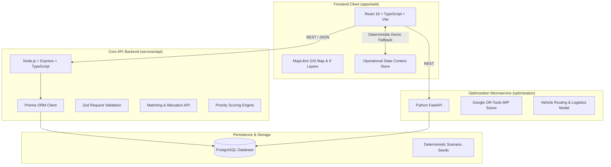

# SAKSHAM — Production & Demonstration Deployment Guide

Disaster Relief Resource-Demand Matching & Logistics Coordination Platform for National & Regional Emergency Operations.

---

## 1. System Architecture Overview



---

## 2. Environment Configuration & Secret Management

All sensitive secrets and environment parameters are externalized through environment variables. **No API keys or database credentials are committed to version control.**

### Root `.env` (Platform-wide)
```bash
NODE_ENV=production
APP_ENV=production
TZ=Asia/Kolkata

DATABASE_URL="postgresql://saksham_admin:<SECURE_PASSWORD>@<DB_HOST>:5432/saksham_disaster_db?schema=public"

PORT=4000
JWT_SECRET="<SECURE_RANDOM_JWT_SECRET>"
JWT_EXPIRES_IN=24h
CORS_ORIGIN=*

OPTIMIZER_PORT=8000
ORTOOLS_MAX_SOLVE_TIME_SECONDS=30

VITE_API_URL=https://api.saksham.gov.in/api
VITE_WS_URL=wss://api.saksham.gov.in/api/v1/ws
VITE_MAP_STYLE_URL=https://basemaps.cartocdn.com/gl/positron-gl-style/style.json
```

---

## 3. Database Setup & Migrations (PostgreSQL + Prisma)

### Initialize Schema
```bash
cd services/api
npm install
npx prisma generate
npx prisma migrate deploy
```

### Seed Deterministic Indian Scenario Data
```bash
npm run prisma:seed
```

---

## 4. Production Build & Validation

### Build Frontend Web Client (`apps/web`)
```bash
cd apps/web
npm install
npm run build
```
*Outputs static assets to `apps/web/dist/` ready for Nginx, Caddy, Vercel, or AWS S3/CloudFront.*

### Build Core Backend (`services/api`)
```bash
cd services/api
npm install
npm run build
npm test
```
*Compiles TypeScript to `services/api/dist/` and executes the 57-test test suite.*

### Run Python Optimization Engine (`optimization`)
```bash
cd optimization
pip install -r requirements.txt
python -m uvicorn main:app --host 0.0.0.0 --port 8000
```

---

## 5. Docker Deployment

### Platform Multi-Service `docker-compose.yml`
```bash
docker-compose up -d --build
```
Services exposed:
- **Web Portal / Command Center:** `http://localhost:5173` (or `http://localhost:80`)
- **API Service:** `http://localhost:4000`
- **Optimization Service:** `http://localhost:8000`
- **PostgreSQL DB:** `localhost:5432`

---

## 6. Zero-External-API Demonstration Mode

When running in self-contained demonstration mode (zero external API dependencies):
1. Navigate to `/operations/command-center`.
2. The persistent **`● DEMO MODE`** indicator in the top navbar indicates local deterministic execution.
3. The platform seeds the **Delhi Yamuna River Monsoon Flood Surge** incident landscape with:
   - 5 demand categories (`WATER`, `MEDICAL`, `FOOD`, `CLOTHING`, `RESCUE_EQUIPMENT`) across `CRITICAL`, `HIGH`, `MEDIUM` priorities.
   - 5 storage depots across AIIMS, Delhi Jal Board, Red Cross, FCI, and NDRF.
   - Scarce resource bottleneck: Inflatable Motorized Rescue Boats (`RES-NCR-005`).
   - Dynamic route penalty: Punjabi Bagh underpass inundation (+18 min ETA) with one-click rerouting.
4. Click **`RESET DEMO`** at any time to restore pristine baseline evaluation state.
